# Deploy desta app no painel Miabi, passo a passo

Este guia registra como a app `miabi-example-l13` (Laravel 13 + Inertia/React) foi publicada em
<https://laravel-example.miabi.unesc.net> pelo painel <https://painel.miabi.unesc.net>,
workspace **Miabi System**.

O deploy usa o caminho mais direto do Miabi: uma **Application** com origem Git que faz build do
`Dockerfile` do repositório. GitOps e pipeline não foram usados; a seção
[GitOps e pipeline](#gitops-e-pipeline) explica por quê e como ligá-los.

Documentação oficial: <https://docs.miabi.io/docs/getting-started/introduction>.

## Resumo do que foi criado

| Recurso | Nome | Detalhe |
| --- | --- | --- |
| Git repository | `miabi-example-l13` | público, `https://github.com/fabriziomachado/miabi-example-l13.git` |
| Database (instância) | `laravel-example` | Postgres 16-alpine no nó `manager` |
| Database (lógico) | `laravel` | usuário gerado pelo Miabi |
| Runner | `wsl-builder` | container `miabi/runner:0.1.0` |
| Application | `laravel-example` | Container, nó `manager`, build `Dockerfile`, porta 8080 |
| Route | `laravel-example` | `laravel-example.miabi.unesc.net`, path `/`, TLS `acme` |

## 1. Conferir os pré-requisitos

### Domínio

**Networking → Domains.** O domínio `miabi.unesc.net` já estava verificado, com wildcard
`*.miabi.unesc.net` e TLS automático. Qualquer subdomínio dele pode virar rota sem mexer em DNS.

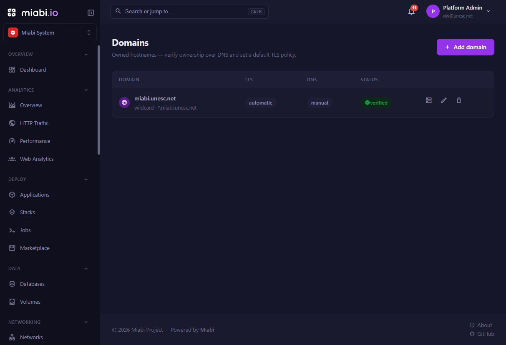

### Container Registry

O registry embutido `registry.miabi.unesc.net` já estava habilitado. É para lá que o runner envia a
imagem construída (`registry.miabi.unesc.net/ws_1/laravel-example`).

## 2. Cadastrar o repositório Git

**Sources → Git Repositories → New repository**, com a URL
`https://github.com/fabriziomachado/miabi-example-l13`. O repositório é público, então não precisa
de segredo. A conexão aparece como conectada (o painel ainda mostra a chave sem tradução
`gitRepos.conn.connected`).

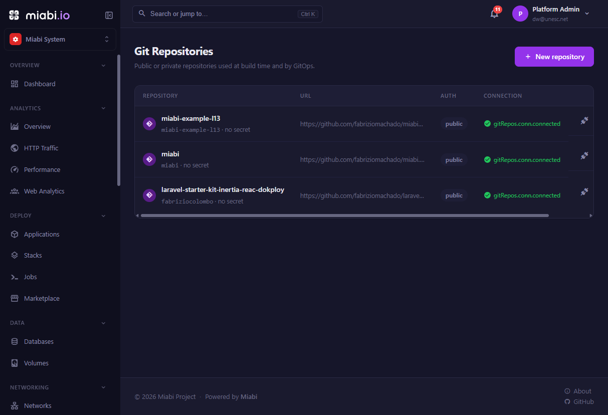

## 3. Criar o banco Postgres

**Data → Databases → New database**:

- Engine: `postgres`, versão `16-alpine`
- Nome: `laravel-example`
- Nó: `manager` (o mesmo nó em que a app vai rodar)

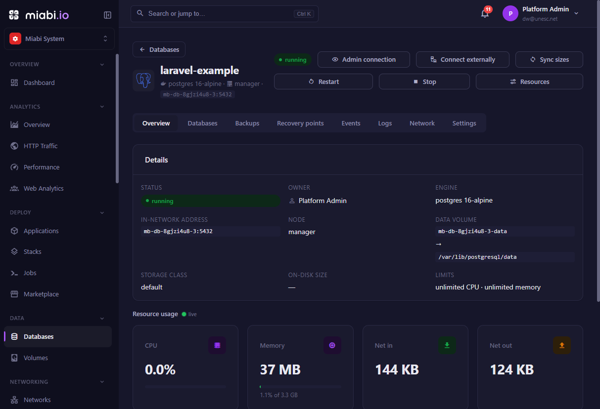

Na aba **Databases** da instância, **New database** cria o banco lógico `laravel`. O Miabi gera o
usuário e a senha. Para ver a senha, use **Reveal connection** (ícone de chave); ela vai para a
variável `DB_PASSWORD` no passo 6.

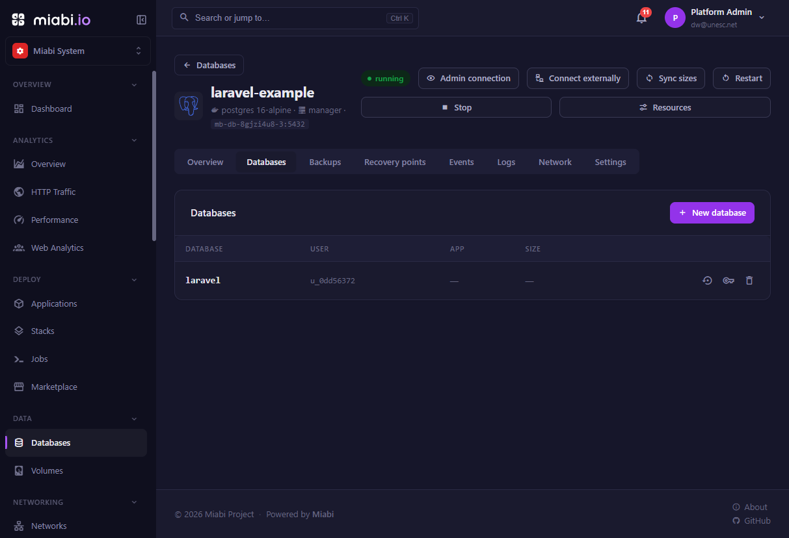

O host interno da instância aparece no topo da página (`mb-db-8gjzi4u8-3:5432`). Ele só resolve
dentro da rede do workspace.

## 4. Registrar um runner de build

Uma app com origem Git precisa de um runner para clonar e fazer o build. Sem runner, o deploy fica
parado em:

```text
waiting for an available runner… (no runner is registered for this workspace — add one in Settings → Runners)
```

**GitOps & CI/CD → Runners → Add runner**, com nome `wsl-builder` e concurrency `1`. O painel
mostra um token uma única vez e o comando para subir o runner em qualquer máquina com Docker:

```bash
docker run -d --name miabi-runner --restart unless-stopped \
  -e MIABI_CONTROL_URL=https://painel.miabi.unesc.net \
  -e MIABI_RUNNER_TOKEN=<token mostrado pelo painel> \
  -v /var/run/docker.sock:/var/run/docker.sock \
  miabi/runner:0.1.0
```

Depois de alguns segundos o runner aparece como `online`.

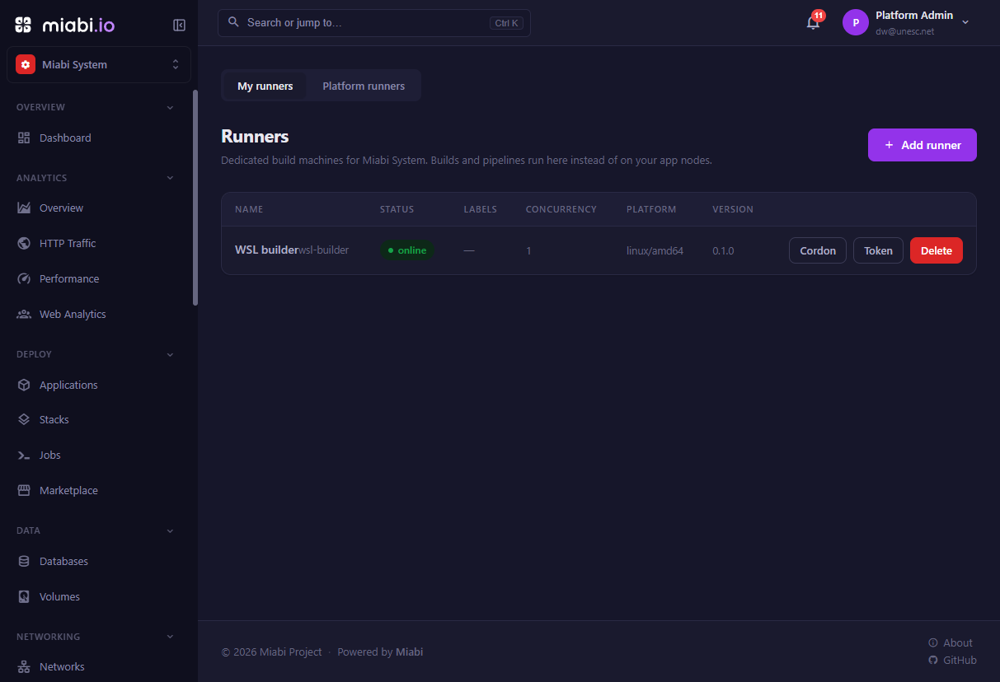

> Neste teste o runner rodou em uma estação de trabalho (WSL). Para uso contínuo, ele deve ficar em
> uma máquina sempre ligada, por exemplo um dos nós do cluster ou uma VM dedicada.

## 5. Criar a aplicação

**Deploy → Applications → New application**:

| Campo | Valor |
| --- | --- |
| Name | `laravel-example` |
| Runtime | `Container (single node)` |
| Node | `manager (manager)` |
| Source | `Git repository` |
| Repository | `miabi-example-l13` |
| Branch | `main` |
| Build method | `Dockerfile` |
| Container port | `8080` / TCP / http |

O nó foi fixado em `manager` porque o banco está nesse nó.

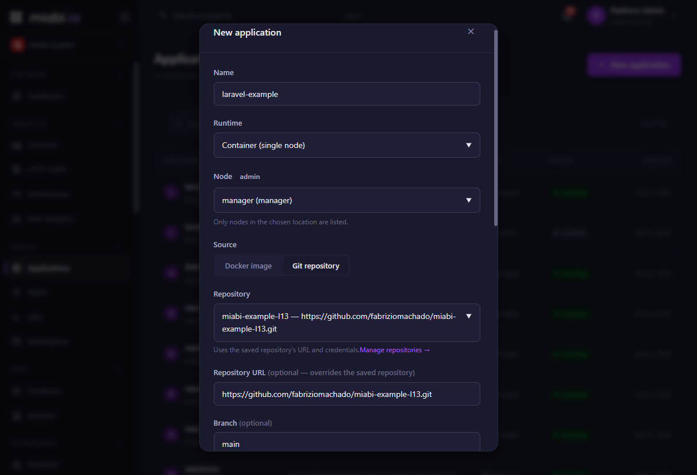

**Check repository** é opcional. Ele lê o repositório e detecta o `Dockerfile` e o
`.miabi/pipeline.yaml`. Quando encontra o pipeline, marca **Use the pipeline from
.miabi/pipeline.yaml**, e a partir daí cada deploy roda os passos do pipeline (testes, build e deploy)
em vez de fazer o build direto.

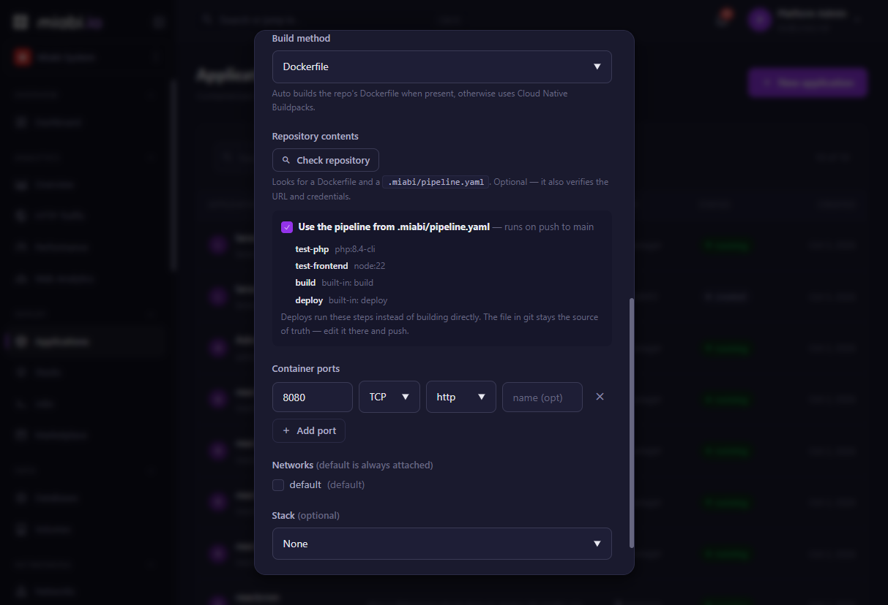

No deploy registrado aqui esse botão **não** foi usado, então a app ficou com build direto pelo
Dockerfile. Veja [GitOps e pipeline](#gitops-e-pipeline).

Clique em **Create application**. A app nasce com status `created` e ainda sem container.

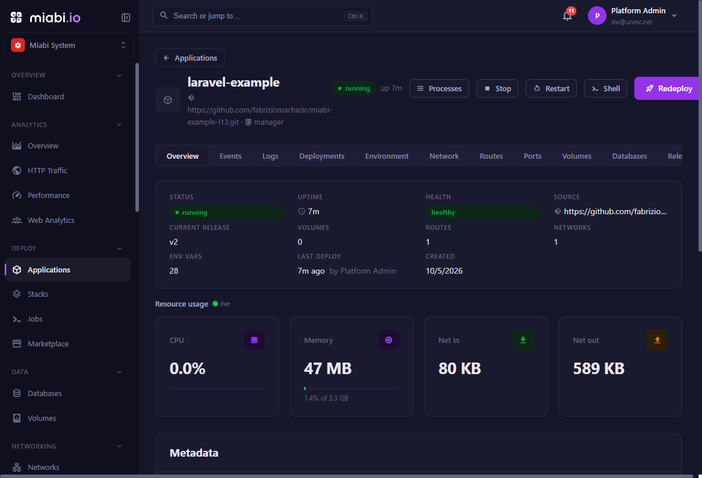

## 6. Variáveis de ambiente

Na aba **Environment**, use **Import .env** e cole as variáveis abaixo. Deixe **Mark all as secrets**
desmarcado nesse lote.

```dotenv
APP_NAME=Laravel
APP_ENV=production
APP_DEBUG=false
APP_URL=https://laravel-example.miabi.unesc.net
ASSET_URL=https://laravel-example.miabi.unesc.net
LOG_CHANNEL=stderr
LOG_LEVEL=info
PHP_OPCACHE_ENABLE=1
DB_CONNECTION=pgsql
DB_HOST=mb-db-8gjzi4u8-3
DB_PORT=5432
DB_DATABASE=laravel
DB_USERNAME=<usuário do banco lógico>
DB_SSLMODE=disable
FILESYSTEM_DISK=public
SESSION_DRIVER=database
CACHE_STORE=database
QUEUE_CONNECTION=database
SSL_MODE=off
HEALTHCHECK_PATH=/up
CADDY_SERVER_ROOT=/var/www/html/public
AUTORUN_ENABLED=true
AUTORUN_LARAVEL_STORAGE_LINK=true
AUTORUN_LARAVEL_MIGRATION=true
AUTORUN_LARAVEL_MIGRATION_FORCE=true
AUTORUN_LARAVEL_OPTIMIZE=true
```

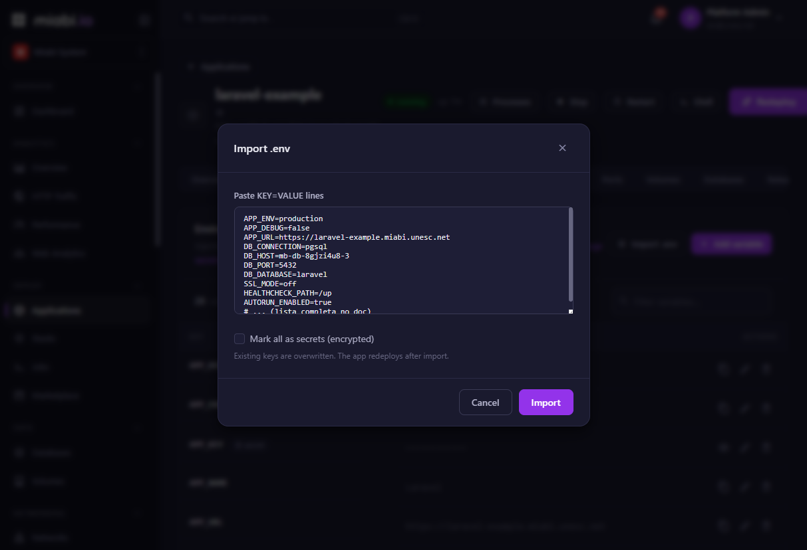

Depois, adicione os dois segredos um a um com **Add variable**, marcando **secret**:

- `APP_KEY`: gere com `php artisan key:generate --show` (formato `base64:...`).
- `DB_PASSWORD`: a senha revelada no passo 3.

O painel mostra os segredos mascarados.

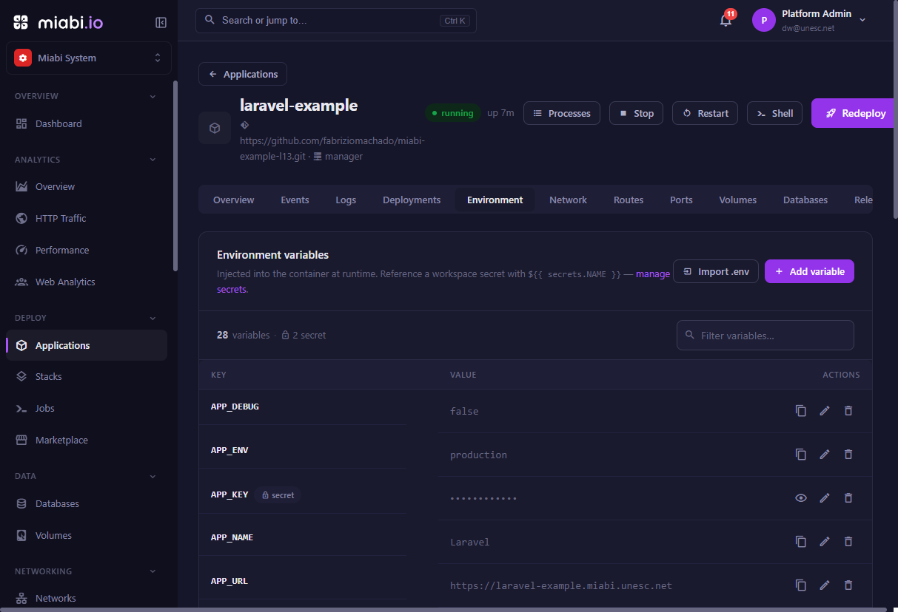

Notas sobre as variáveis:

- `SSL_MODE=off`: o TLS termina no gateway do Miabi; o FrankenPHP atende HTTP puro na 8080.
- `ASSET_URL`: força os links do Vite em HTTPS. O código também confia no proxy
  (`trustProxies(at: '*')` em `bootstrap/app.php`).
- `AUTORUN_*`: a imagem `serversideup/php` roda `storage:link`, `migrate --force` e `optimize` na
  subida do container.

## 7. Health check

Na aba **Settings**, seção **Healthcheck**:

| Campo | Valor |
| --- | --- |
| Type | `HTTP` |
| Path | `/up` |
| Port | `8080` |
| Interval / Timeout / Retries | `30` / `10` / `5` |
| Start period | `90` |

O start period dá tempo para as migrações e o `optimize` antes de o Miabi considerar o container
saudável. Clique em **Save healthcheck**.

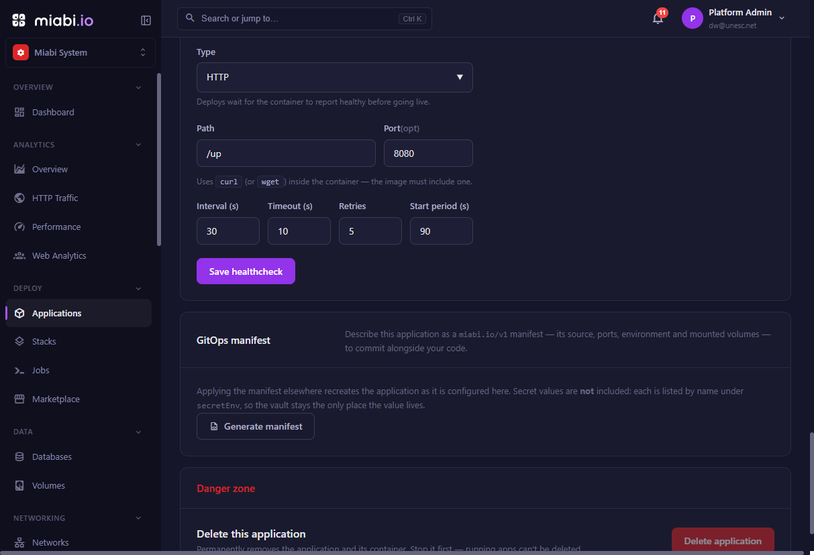

## 8. Rota pública

Na aba **Routes**, **Add route**:

| Campo | Valor |
| --- | --- |
| Name | `laravel-example` |
| Target port | `8080` |
| Hosts | subdomínio `laravel-example` + domínio `miabi.unesc.net` |
| Path | `/` |
| TLS | `acme` |

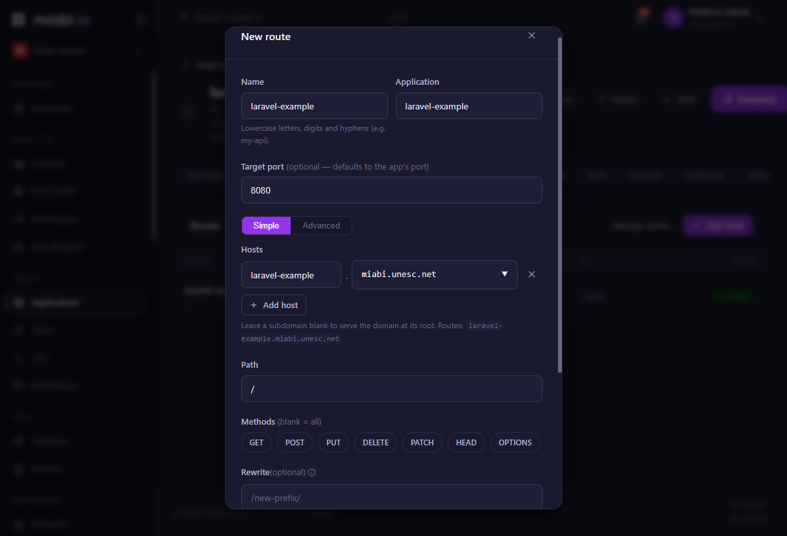

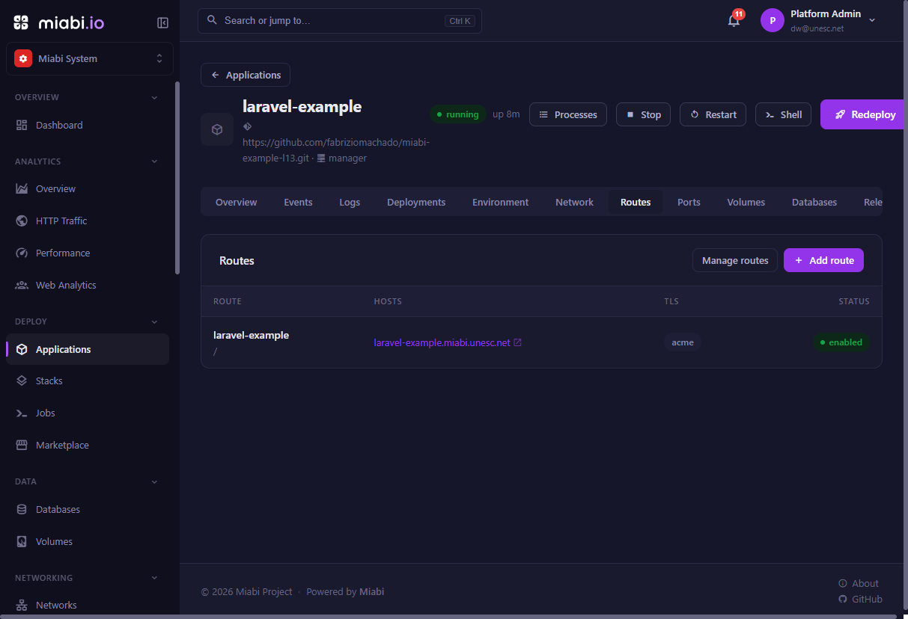

## 9. Deploy

Clique em **Redeploy** (ou **Deploy** no primeiro). A aba **Deployments** mostra o log: clone,
build da imagem no runner, push para o registry, criação do container, espera pelo health check e
sincronização da rota.

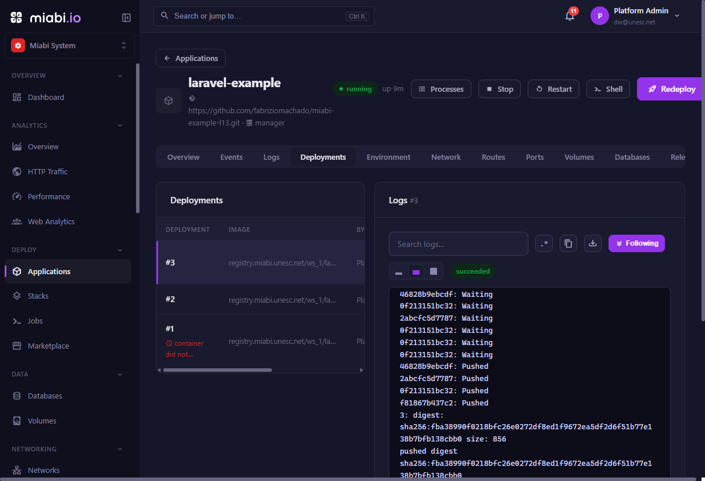

O deploy termina com:

```text
container is healthy
proxy routes synced
deployment succeeded (release v2)
```

## 10. Resultado

<https://laravel-example.miabi.unesc.net> responde em HTTPS e `/up` retorna 200.

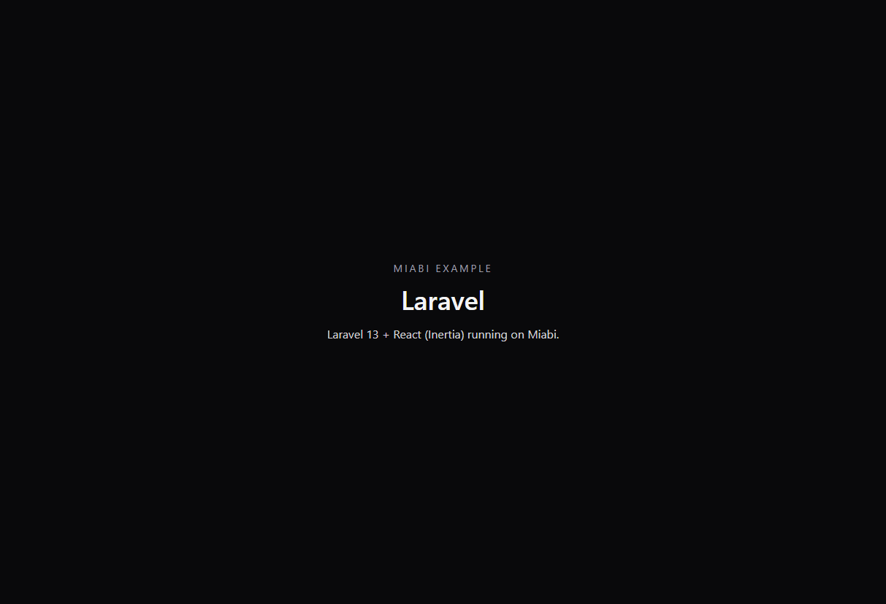

## Problemas encontrados

| Sintoma | Causa | Correção |
| --- | --- | --- |
| Deploy parado em "waiting for an available runner" | Workspace sem runner | Registrar e subir um runner (passo 4) |
| Container reiniciando com `View path not found` / `Laravel optimize failed` | O `.dockerignore` exclui `storage/framework/views` e a imagem não recriava a pasta | O `Dockerfile` cria `storage/framework/{cache/data,sessions,views}` e `storage/logs` |
| CSS e JS carregando em `http://` | O Laravel via a requisição como HTTP atrás do gateway | `trustProxies(at: '*')` e `ASSET_URL` |
| Diff do GitOps `laravel-dev-test` com erro 500 `reference not found` | A versão do painel (1.10.11) não resolveu a branch `cursor/laravel-inertia-gitops-example-0a1e`, que tem barra no nome | Usar uma branch sem barra ou atualizar o painel |

## GitOps e pipeline

Nada desta app aparece em **GitOps** nem em **Pipelines**, e isso é esperado: ela foi criada como
uma Application avulsa, configurada à mão no painel.

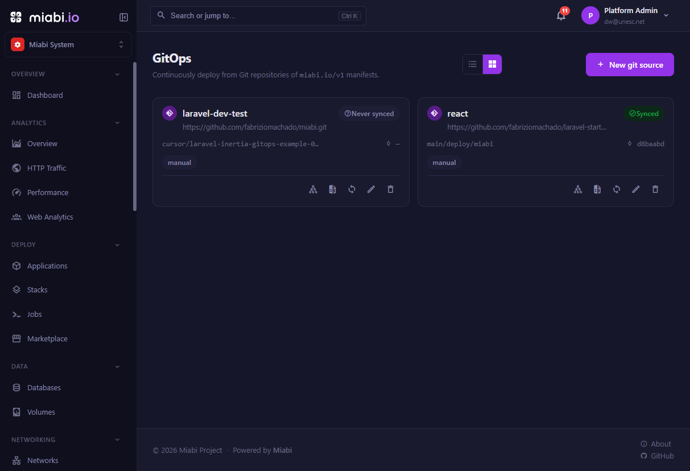

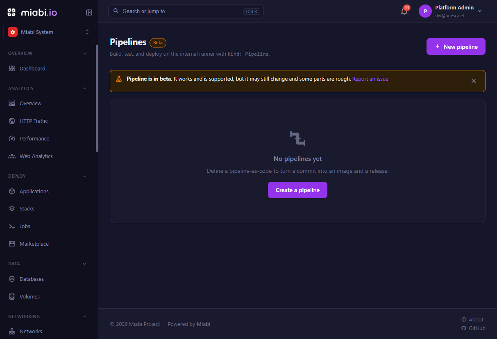

### Pipeline

O repositório tem `.miabi/pipeline.yaml`, mas o Miabi só adota o arquivo quando a opção **Use the
pipeline from .miabi/pipeline.yaml** está marcada. Ela aparece depois de **Check repository** na
criação (passo 5), e esse botão não foi usado. Para ligar numa app que já existe, há o endpoint de
resync (`POST /apps/{id}/pipeline/resync`), que adota o pipeline do repositório.

Com o pipeline ligado, cada deploy roda `test-php`, `test-frontend`, `build` e `deploy`, e um push
na `main` dispara o pipeline. O deploy direto pelo Dockerfile foi mantido no primeiro teste para
isolar problemas de imagem dos problemas de CI.

### GitOps

Os manifests ficam em `envs/dev/stack.yaml` e `envs/prod/stack.yaml`, no mesmo formato de
`examples/laravel-inertia`, com o registry `registry.miabi.unesc.net/ws_1/laravel-example` e o host
`laravel-example.miabi.unesc.net`. O domínio `miabi.unesc.net` não entra no manifesto: ele já está
verificado no painel, e o GitOps não deve assumir a zona.

O GitSource `laravel-dev-test` (branch `cursor/laravel-inertia-gitops-example-0a1e` no fork da
plataforma) foi removido. Ele nunca sincronizou: o painel 1.10.11 não resolve branch com barra no
nome, e o stack ainda tinha placeholders. A fonte nova aponta para este repositório, branch `main`,
caminho `envs/dev`, sync manual e prune desligado. `envs/prod` fica só no Git — sincronizar os dois
no mesmo workspace colide nos nomes.

Antes de sincronizar, troque o `APP_KEY` placeholder em `envs/dev/stack.yaml`. O GitOps substitui o
env da app pelo arquivo, então um sync com o placeholder apaga a chave que já está no painel.
